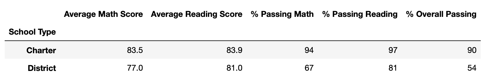

# School_District_Analysis
### Overview
    Throughout this module we helped Maria analyze school district test data to gain insights on performance trends on standardized tests. This data analysis will help the school board make better financial decisions based on the performance of schools throughout the district. In this analysis we used tools such as, Jupyter Notebooks, Anaconda Navigator, the zsh terminal and Pandas, as well as Python3.
### Results
    Through the analysis we discovered a lot and determined budgets for schools as well as gather averages for many different data points and later converted them into many different data frames for further analysis.

### 
### 
### 
### 
### 
### 
### Summary
    In summary, the smaller school sizes performed the best overall. 

### Technologies Used
    * Python 3
    * Jupyter Notebook
    * Pandas
    * Matplotlib
    * VS Code
    * zsh terminal
    * Git
    * Github   
